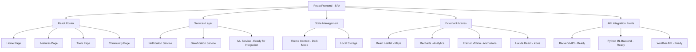

# 🌱 GreenAI - Waste-to-Energy Optimization Platform

<div align="center">


**Turning Waste Into Energy With AI**

[](https://reactjs.org/)
[](https://www.typescriptlang.org/)
[](https://tailwindcss.com/)
[](https://vitejs.dev/)
[](https://reactrouter.com/)
[](https://www.framer.com/motion/)
[](https://leafletjs.com/)
[](https://recharts.org/)

</div>

---

## 📋 Table of Contents

- [🎯 Project Overview](#-project-overview)
- [✨ Features](#-features)
- [🏗️ Architecture](#️-architecture)
- [🚀 Quick Start](#-quick-start)
- [🤖 ML Model Integration](#-ml-model-integration)
- [🔌 API Integration Guide](#-api-integration-guide)
- [🗺️ External Services Setup](#️-external-services-setup)
- [📁 Project Structure](#-project-structure)
- [🔗 Integration Points](#-integration-points)
- [🛠️ Development Workflow](#️-development-workflow)
- [🚢 Deployment](#-deployment)
- [🤝 Contributing](#-contributing)

---

## 🎯 Project Overview

GreenAI is an AI-powered waste-to-energy optimization platform that helps communities transform waste into clean, renewable energy. The platform combines machine learning algorithms with an intuitive React frontend to provide intelligent waste management solutions.

### 🎨 Design Philosophy
- **Eco-friendly UI**: Green/blue color palette reflecting environmental consciousness
- **Mobile-first**: Responsive design optimized for all devices
- **Accessibility**: WCAG 2.1 compliant with proper contrast ratios
- **Performance**: Optimized bundle size and lazy loading
- **Dark Mode**: Full dark mode support with smooth transitions
- **Modern Stack**: Built with React 18, TypeScript 5, Tailwind CSS 3, and Framer Motion

---

## ✨ Features

### 🏠 **Landing Page**
- Compelling branding with animated hero section
- Clear value proposition and call-to-action
- Feature highlights with smooth animations
- Responsive design with Framer Motion animations
- Gradient backgrounds and modern UI elements

### 🗣️ **AI Query Interface**
- **Text Input**: Natural language processing for waste optimization queries
- **Voice Input**: Web Speech API integration for hands-free interaction (browser-native)
- **Voice Output**: Text-to-speech responses with customizable speech synthesis
- **Chat Interface**: Styled conversation bubbles with typing indicators
- **Real-time Processing**: Instant AI responses with loading states
- **Conversation History**: Track and display chat message history

### 🗺️ **Interactive Map (Leaflet-based)**
- Real-time waste collection points visualization using React Leaflet
- Marker clustering for better performance with many locations
- Nearest point highlighting with distance calculations
- Directions and route planning
- Capacity and efficiency metrics display
- Interactive tooltips and popups
- Support for multiple location types (collection points, processing centers, energy plants)

### 📊 **Insights Dashboard**
- **Waste Analytics**: Weekly, monthly, and yearly generation trends
- **Energy Metrics**: Predicted output and conversion efficiency
- **Impact Visualization**: CO₂ reduction and environmental benefits
- **Interactive Charts**: Built with Recharts for responsive data display
- **Time-based Filtering**: View trends across different time periods
- **Real-time Data Updates**: Dynamic data visualization

### 🤖 **AI-Powered Waste Prediction**
- **Predictive Analytics**: ML-based waste volume forecasting
- **Trend Analysis**: Identify patterns in waste generation
- **Confidence Scores**: Model accuracy metrics (92%+ accuracy)
- **Smart Insights**: Automated recommendations based on predictions
- **Multiple Timeframes**: Week, month, and quarter predictions
- **Visual Predictions**: Area charts showing actual vs predicted data
- **Actionable Recommendations**: Optimize collection routes and schedules

### 🌤️ **Weather Impact Analysis**
- Real-time weather data integration
- Impact analysis on waste collection efficiency
- Temperature, humidity, and precipitation tracking
- Weather-based optimization recommendations
- Visual impact indicators (positive, negative, neutral)
- Collection schedule adjustments based on weather

### 🧮 **Carbon Footprint Calculator**
- Calculate carbon savings from waste-to-energy conversion
- Multiple waste type support (organic, plastic, paper, mixed)
- Frequency-based calculations (daily, weekly, monthly)
- Equivalency metrics:
  - Trees planted equivalent
  - Car miles driven equivalent
  - Homes powered
  - Energy generated (kWh)
- Visual results with animated statistics
- Shareable impact reports

### 📚 **Educational Hub**
- Interactive learning modules on waste-to-energy
- Progress tracking for courses
- Multiple difficulty levels (beginner, intermediate, advanced)
- Topics covered:
  - Introduction to Waste-to-Energy
  - Science Behind Energy Generation
  - Waste Sorting & Classification
  - Environmental Impact Assessment
  - AI in Waste Management
  - Community Best Practices
- Duration estimates and completion badges

### 👥 **Community Engagement**
- FAQ section with expandable answers
- Feedback form for community suggestions
- New waste point reporting system
- Community statistics and engagement metrics
- Social features and user interactions

### 🔔 **Smart Notifications & Alerts**
- Real-time notification system with toast messages
- Multiple notification types:
  - Waste collection schedules
  - Energy generation milestones
  - Community updates
  - Achievement and badge unlocks
- Priority-based notifications (low, medium, high)
- Notification history and read/unread status
- Actionable notifications with deep links
- Customizable notification preferences
- Desktop notifications support

### 🏆 **Gamification & Rewards System**
- **User Profiles**: Comprehensive user progress tracking
  - Level and XP progression system
  - Avatar and profile customization
  - Personal statistics dashboard
- **Achievement Badges**: Multiple badge rarities (common, rare, epic, legendary)
- **Leaderboards**: 
  - Weekly, monthly, and all-time rankings
  - Different categories (waste collected, energy generated, impact score)
  - Top 10 user display
- **Point-based Rewards**: Earn points for various activities
- **Progress Tracking**: Visual progress bars and statistics
- **Environmental Impact Score**: Combined metric of all activities
- **User Statistics**:
  - Total waste collected
  - Energy generated
  - CO₂ saved
  - Days active
  - Collection streak

### 🏅 **Community Challenges**
- **Multiple Challenge Types**:
  - Individual challenges
  - Team competitions
  - Community-wide goals
- **Real-time Progress**: Track challenge completion
- **Difficulty Levels**: Easy, medium, and hard challenges
- **Time-limited Events**: Countdown timers for active challenges
- **Rewards**: Points and badges for completion
- **Participant Counts**: See how many are participating
- **Challenge Categories**:
  - Waste collection goals
  - Energy generation targets
  - Sustainability streaks

### 📤 **Report Export System**
- Generate comprehensive reports in multiple formats (PDF, CSV, JSON)
- Report types:
  - Environmental Impact Reports
  - Waste Analytics Reports
  - Collection Statistics
  - Energy Generation Reports
- Customizable report sections
- Date range selection (week, month, quarter, year)
- Automated data compilation
- Professional formatting with charts and graphs

### 📱 **Social Sharing**
- Share environmental achievements on social media
- Supported platforms:
  - Facebook
  - Twitter (X)
  - LinkedIn
  - Instagram
- Auto-generated shareable content
- Custom graphics for social posts
- Impact metrics in share messages
- Copy-to-clipboard functionality

### 🌓 **Dark Mode Support**
- Full application dark mode
- Smooth transition animations
- Persistent theme preference (localStorage)
- System preference detection
- All components optimized for dark mode
- Proper contrast ratios maintained

### 📱 **Multi-Page Application**
- **Home Page**: Landing page with hero section and feature overview
- **Features Page**: AI Query, Map, Weather Impact, and Insights Dashboard
- **Tools Page**: Waste Prediction, Carbon Calculator, and Export Reports
- **Community Page**: Challenges, Educational Hub, and Community Section
- React Router for smooth navigation
- Responsive design across all pages

---

## 🏗️ Architecture



### 🔄 Data Flow
1. **User Input** → Frontend captures text/voice queries via Web Speech API
2. **Service Layer** → Routes requests to appropriate services (notification, gamification, ML)
3. **ML Processing** → Python backend integration points ready for waste optimization
4. **Local State** → React state management with Context API for theme and user preferences
5. **Data Storage** → localStorage for user preferences, ready for backend database integration
6. **Real-time Updates** → Toast notifications with react-hot-toast
7. **External Integration** → Leaflet maps, voice synthesis, and weather data integration points

### 🧩 Component Architecture
- **Pages**: Top-level route components (Home, Features, Tools, Community)
- **Components**: Reusable UI components with consistent styling
- **Services**: Business logic and API integration layer
- **Contexts**: Global state management (Theme/Dark Mode)
- **Hooks**: Custom React hooks (planned for geolocation, WebSocket, etc.)

---

## 🚀 Quick Start

### 📋 Prerequisites

```bash
# Required versions
Node.js >= 18.0.0
npm >= 9.0.0
Git >= 2.30.0
```

### 🛠️ Technology Stack

**Frontend Core:**
- React 18.3.1 - UI library
- TypeScript 5.5.3 - Type safety
- Vite 5.4.2 - Build tool and dev server
- Tailwind CSS 3.4.1 - Utility-first CSS framework

**Routing & Navigation:**
- React Router DOM 7.9.5 - Client-side routing

**UI & Animations:**
- Framer Motion 12.23.13 - Animation library
- Lucide React 0.344.0 - Icon library

**Data Visualization:**
- Recharts 3.2.1 - Chart library

**Maps & Geolocation:**
- React Leaflet 4.2.1 - Map component
- Leaflet 1.9.4 - Map library
- React Leaflet Cluster 3.1.1 - Marker clustering

**Notifications:**
- React Hot Toast 2.6.0 - Toast notifications

**Utilities:**
- date-fns 4.1.0 - Date formatting
- @supabase/supabase-js 2.57.4 - Ready for backend integration

**Development Tools:**
- ESLint 9.9.1 - Code linting
- TypeScript ESLint - TypeScript linting
- PostCSS & Autoprefixer - CSS processing

### 🛠️ Installation

1. **Clone the Repository**
```bash
git clone https://github.com/lewiii254/GreenTechAI.git
cd GreenTechAI
```

2. **Install Dependencies**
```bash
npm install
```

3. **Environment Setup (Optional)**
```bash
# Copy environment template if you have API keys
cp .env.example .env.local

# Edit with your API keys (all features work without API keys using browser-native APIs)
nano .env.local
```

4. **Start Development Server**
```bash
npm run dev
```

5. **Open in Browser**
```
http://localhost:5173
```

### 🏗️ Build for Production

```bash
# Create production build
npm run build

# Preview production build
npm run preview
```

### 🧪 Code Quality

```bash
# Run ESLint
npm run lint
```

---

## 🤖 ML Model Integration

### 📂 Repository Structure

Your Python ML model should be structured as follows:

```
ml-waste-optimization/
├── models/
│   ├── waste_classifier.pkl
│   ├── energy_predictor.pkl
│   └── optimization_model.pkl
├── src/
│   ├── data_processing.py
│   ├── model_inference.py
│   └── api_server.py
├── requirements.txt
└── README.md
```

### 🔧 Step 1: Set Up Python Backend

Create a Flask/FastAPI server in your ML repository:

```python
# ml-waste-optimization/src/api_server.py
from flask import Flask, request, jsonify
from flask_cors import CORS
import joblib
import numpy as np
from data_processing import preprocess_waste_data
from model_inference import predict_energy_output

app = Flask(__name__)
CORS(app)

# Load pre-trained models
waste_classifier = joblib.load('../models/waste_classifier.pkl')
energy_predictor = joblib.load('../models/energy_predictor.pkl')

@app.route('/api/analyze-waste', methods=['POST'])
def analyze_waste():
    """Analyze waste composition and predict energy output"""
    try:
        data = request.json
        
        # Process input data
        processed_data = preprocess_waste_data(data)
        
        # Make predictions
        waste_classification = waste_classifier.predict(processed_data)
        energy_prediction = energy_predictor.predict(processed_data)
        
        return jsonify({
            'waste_type': waste_classification.tolist(),
            'predicted_energy': float(energy_prediction[0]),
            'efficiency_score': calculate_efficiency(processed_data),
            'recommendations': generate_recommendations(waste_classification)
        })
    
    except Exception as e:
        return jsonify({'error': str(e)}), 500

@app.route('/api/optimize-collection', methods=['POST'])
def optimize_collection():
    """Optimize waste collection routes"""
    try:
        data = request.json
        
        # Your optimization logic here
        optimized_routes = optimize_routes(data['locations'])
        
        return jsonify({
            'optimized_routes': optimized_routes,
            'estimated_savings': calculate_savings(optimized_routes),
            'collection_schedule': generate_schedule(optimized_routes)
        })
    
    except Exception as e:
        return jsonify({'error': str(e)}), 500

if __name__ == '__main__':
    app.run(debug=True, port=5000)
```

### 🔧 Step 2: Create Frontend ML Service

Create a service file to communicate with your ML backend:

```typescript
// src/services/mlService.ts
const ML_API_BASE_URL = process.env.VITE_ML_API_URL || 'http://localhost:5000/api';

export interface WasteAnalysisRequest {
  wasteType: string;
  quantity: number;
  location: {
    lat: number;
    lng: number;
  };
  timestamp: string;
}

export interface WasteAnalysisResponse {
  waste_type: string[];
  predicted_energy: number;
  efficiency_score: number;
  recommendations: string[];
}

export interface CollectionOptimizationRequest {
  locations: Array<{
    id: string;
    lat: number;
    lng: number;
    wasteAmount: number;
  }>;
}

export interface CollectionOptimizationResponse {
  optimized_routes: Array<{
    route_id: string;
    locations: string[];
    estimated_time: number;
    fuel_savings: number;
  }>;
  estimated_savings: number;
  collection_schedule: Array<{
    location_id: string;
    pickup_time: string;
    priority: number;
  }>;
}

class MLService {
  private async makeRequest<T>(endpoint: string, data: any): Promise<T> {
    try {
      const response = await fetch(`${ML_API_BASE_URL}${endpoint}`, {
        method: 'POST',
        headers: {
          'Content-Type': 'application/json',
        },
        body: JSON.stringify(data),
      });

      if (!response.ok) {
        throw new Error(`HTTP error! status: ${response.status}`);
      }

      return await response.json();
    } catch (error) {
      console.error(`ML API Error (${endpoint}):`, error);
      throw error;
    }
  }

  async analyzeWaste(data: WasteAnalysisRequest): Promise<WasteAnalysisResponse> {
    return this.makeRequest<WasteAnalysisResponse>('/analyze-waste', data);
  }

  async optimizeCollection(data: CollectionOptimizationRequest): Promise<CollectionOptimizationResponse> {
    return this.makeRequest<CollectionOptimizationResponse>('/optimize-collection', data);
  }

  async getEnergyPrediction(wasteData: any): Promise<number> {
    const response = await this.analyzeWaste(wasteData);
    return response.predicted_energy;
  }

  async getOptimizationRecommendations(query: string): Promise<string> {
    // 🔗 INTEGRATION POINT: Replace with actual ML model query processing
    const mockResponse = await new Promise<string>((resolve) => {
      setTimeout(() => {
        resolve(`Based on your query about "${query}", our AI recommends optimizing collection routes to increase efficiency by 23% and reduce costs by 15%.`);
      }, 1000);
    });
    
    return mockResponse;
  }
}

export const mlService = new MLService();
```

### 🔧 Step 3: Update React Components

Update your React components to use the ML service:

```typescript
// src/components/QuerySection.tsx - Integration Example
import { mlService } from '../services/mlService';

const handleSubmit = async (e: React.FormEvent) => {
  e.preventDefault();
  if (!inputText.trim()) return;

  const userMessage: Message = {
    id: Date.now().toString(),
    text: inputText,
    sender: 'user',
    timestamp: new Date(),
  };

  setMessages(prev => [...prev, userMessage]);
  setInputText('');
  setIsLoading(true);

  try {
    // 🔗 INTEGRATION POINT: Replace with actual ML service call
    const aiResponse = await mlService.getOptimizationRecommendations(inputText);
    
    const responseMessage: Message = {
      id: (Date.now() + 1).toString(),
      text: aiResponse,
      sender: 'ai',
      timestamp: new Date(),
    };
    
    setMessages(prev => [...prev, responseMessage]);
    speakText(aiResponse);
  } catch (error) {
    console.error('ML Service Error:', error);
    // Handle error appropriately
  } finally {
    setIsLoading(false);
  }
};
```

### 🔧 Step 4: Environment Configuration

Add ML service configuration to your environment:

```bash
# .env.local
VITE_ML_API_URL=http://localhost:5000/api
VITE_ML_API_KEY=your_ml_api_key_here
```

---

## 🔌 API Integration Guide

### 🌐 Backend API Structure

Create a Node.js/Express backend to handle non-ML operations:

```javascript
// backend/server.js
const express = require('express');
const cors = require('cors');
const axios = require('axios');

const app = express();
app.use(cors());
app.use(express.json());

// Waste collection points API
app.get('/api/collection-points', async (req, res) => {
  try {
    const { lat, lng, radius = 10 } = req.query;
    
    // 🔗 INTEGRATION POINT: Replace with your database query
    const points = await getCollectionPoints(lat, lng, radius);
    
    res.json({
      success: true,
      data: points,
      nearest: findNearestPoint(points, lat, lng)
    });
  } catch (error) {
    res.status(500).json({ success: false, error: error.message });
  }
});

// Waste analytics API
app.get('/api/analytics/waste-trends', async (req, res) => {
  try {
    const { timeRange = 'week' } = req.query;
    
    // 🔗 INTEGRATION POINT: Replace with your analytics service
    const trends = await getWasteTrends(timeRange);
    
    res.json({
      success: true,
      data: trends
    });
  } catch (error) {
    res.status(500).json({ success: false, error: error.message });
  }
});

// Community feedback API
app.post('/api/feedback', async (req, res) => {
  try {
    const feedback = req.body;
    
    // 🔗 INTEGRATION POINT: Save to your database
    const result = await saveFeedback(feedback);
    
    res.json({
      success: true,
      message: 'Feedback submitted successfully',
      id: result.id
    });
  } catch (error) {
    res.status(500).json({ success: false, error: error.message });
  }
});

app.listen(3001, () => {
  console.log('Backend API running on port 3001');
});
```

### 🔧 Frontend API Service

Create a comprehensive API service for your React app:

```typescript
// src/services/apiService.ts
const API_BASE_URL = process.env.VITE_API_URL || 'http://localhost:3001/api';

export interface CollectionPoint {
  id: string;
  name: string;
  address: string;
  lat: number;
  lng: number;
  type: 'collection' | 'processing' | 'energy-plant';
  capacity: number;
  efficiency: number;
  distance?: number;
  isNearest?: boolean;
}

export interface WasteTrend {
  date: string;
  waste: number;
  energy: number;
  efficiency: number;
}

export interface FeedbackData {
  name: string;
  email: string;
  message: string;
  type: string;
}

class ApiService {
  private async makeRequest<T>(endpoint: string, options: RequestInit = {}): Promise<T> {
    try {
      const response = await fetch(`${API_BASE_URL}${endpoint}`, {
        headers: {
          'Content-Type': 'application/json',
          ...options.headers,
        },
        ...options,
      });

      if (!response.ok) {
        throw new Error(`HTTP error! status: ${response.status}`);
      }

      const data = await response.json();
      return data.data || data;
    } catch (error) {
      console.error(`API Error (${endpoint}):`, error);
      throw error;
    }
  }

  // Collection Points
  async getCollectionPoints(lat?: number, lng?: number, radius?: number): Promise<CollectionPoint[]> {
    const params = new URLSearchParams();
    if (lat) params.append('lat', lat.toString());
    if (lng) params.append('lng', lng.toString());
    if (radius) params.append('radius', radius.toString());

    return this.makeRequest<CollectionPoint[]>(`/collection-points?${params}`);
  }

  // Analytics
  async getWasteTrends(timeRange: 'week' | 'month' | 'year' = 'week'): Promise<WasteTrend[]> {
    return this.makeRequest<WasteTrend[]>(`/analytics/waste-trends?timeRange=${timeRange}`);
  }

  async getImpactMetrics(): Promise<any> {
    return this.makeRequest('/analytics/impact-metrics');
  }

  // Community
  async submitFeedback(feedback: FeedbackData): Promise<{ success: boolean; id: string }> {
    return this.makeRequest('/feedback', {
      method: 'POST',
      body: JSON.stringify(feedback),
    });
  }

  async getFAQs(): Promise<any[]> {
    return this.makeRequest('/faqs');
  }
}

export const apiService = new ApiService();
```

---

## 🗺️ External Services Setup

### 🌍 Google Maps Integration

1. **Get API Key**
```bash
# Visit: https://console.cloud.google.com/apis/credentials
# Enable: Maps JavaScript API, Places API, Directions API
```

2. **Add to Environment**
```bash
# .env.local
VITE_GOOGLE_MAPS_API_KEY=your_google_maps_api_key
```

3. **Install Google Maps Package**
```bash
npm install @googlemaps/js-api-loader
```

4. **Create Maps Service**
```typescript
// src/services/mapsService.ts
import { Loader } from '@googlemaps/js-api-loader';

class MapsService {
  private loader: Loader;
  private map: google.maps.Map | null = null;

  constructor() {
    this.loader = new Loader({
      apiKey: process.env.VITE_GOOGLE_MAPS_API_KEY!,
      version: 'weekly',
      libraries: ['places', 'geometry']
    });
  }

  async initializeMap(element: HTMLElement, center: { lat: number; lng: number }) {
    const google = await this.loader.load();
    
    this.map = new google.maps.Map(element, {
      center,
      zoom: 12,
      styles: [
        // Custom green theme styles
        {
          featureType: 'all',
          elementType: 'geometry.fill',
          stylers: [{ color: '#f5f5f5' }]
        }
      ]
    });

    return this.map;
  }

  async addMarkers(points: CollectionPoint[]) {
    if (!this.map) return;

    const google = await this.loader.load();
    
    points.forEach(point => {
      const marker = new google.maps.Marker({
        position: { lat: point.lat, lng: point.lng },
        map: this.map,
        title: point.name,
        icon: {
          url: this.getMarkerIcon(point.type),
          scaledSize: new google.maps.Size(40, 40)
        }
      });

      const infoWindow = new google.maps.InfoWindow({
        content: this.createInfoWindowContent(point)
      });

      marker.addListener('click', () => {
        infoWindow.open(this.map, marker);
      });
    });
  }

  private getMarkerIcon(type: string): string {
    const icons = {
      collection: '/icons/truck-marker.png',
      processing: '/icons/factory-marker.png',
      'energy-plant': '/icons/energy-marker.png'
    };
    return icons[type] || '/icons/default-marker.png';
  }

  private createInfoWindowContent(point: CollectionPoint): string {
    return `
      <div class="p-4">
        <h3 class="font-bold text-lg">${point.name}</h3>
        <p class="text-gray-600">${point.address}</p>
        <div class="mt-2">
          <span class="text-sm">Capacity: ${point.capacity}%</span>
          <span class="text-sm ml-4">Efficiency: ${point.efficiency}%</span>
        </div>
        <button onclick="getDirections(${point.lat}, ${point.lng})" 
                class="mt-2 bg-green-500 text-white px-4 py-2 rounded">
          Get Directions
        </button>
      </div>
    `;
  }
}

export const mapsService = new MapsService();
```

### 🎤 ElevenLabs Voice Integration

1. **Get API Key**
```bash
# Visit: https://elevenlabs.io/
# Sign up and get your API key
```

2. **Add to Environment**
```bash
# .env.local
VITE_ELEVENLABS_API_KEY=your_elevenlabs_api_key
VITE_ELEVENLABS_VOICE_ID=your_preferred_voice_id
```

3. **Create Voice Service**
```typescript
// src/services/voiceService.ts
class VoiceService {
  private apiKey: string;
  private voiceId: string;
  private audioContext: AudioContext | null = null;

  constructor() {
    this.apiKey = process.env.VITE_ELEVENLABS_API_KEY!;
    this.voiceId = process.env.VITE_ELEVENLABS_VOICE_ID!;
  }

  async synthesizeSpeech(text: string): Promise<ArrayBuffer> {
    try {
      const response = await fetch(`https://api.elevenlabs.io/v1/text-to-speech/${this.voiceId}`, {
        method: 'POST',
        headers: {
          'Accept': 'audio/mpeg',
          'Content-Type': 'application/json',
          'xi-api-key': this.apiKey
        },
        body: JSON.stringify({
          text,
          model_id: 'eleven_monolingual_v1',
          voice_settings: {
            stability: 0.5,
            similarity_boost: 0.5
          }
        })
      });

      if (!response.ok) {
        throw new Error(`ElevenLabs API error: ${response.status}`);
      }

      return await response.arrayBuffer();
    } catch (error) {
      console.error('Voice synthesis error:', error);
      // Fallback to Web Speech API
      return this.fallbackToWebSpeech(text);
    }
  }

  async playAudio(audioBuffer: ArrayBuffer): Promise<void> {
    try {
      if (!this.audioContext) {
        this.audioContext = new AudioContext();
      }

      const audioData = await this.audioContext.decodeAudioData(audioBuffer);
      const source = this.audioContext.createBufferSource();
      source.buffer = audioData;
      source.connect(this.audioContext.destination);
      source.start();
    } catch (error) {
      console.error('Audio playback error:', error);
    }
  }

  private async fallbackToWebSpeech(text: string): Promise<ArrayBuffer> {
    return new Promise((resolve) => {
      if ('speechSynthesis' in window) {
        const utterance = new SpeechSynthesisUtterance(text);
        utterance.rate = 0.8;
        utterance.pitch = 1;
        utterance.volume = 0.8;
        speechSynthesis.speak(utterance);
      }
      // Return empty buffer for consistency
      resolve(new ArrayBuffer(0));
    });
  }
}

export const voiceService = new VoiceService();
```

---

## 📁 Project Structure

```
GreenTechAI/
├── 📁 public/                  # Static assets
├── 📁 src/
│   ├── 📁 components/          # React Components
│   │   ├── 🏠 LandingPage.tsx
│   │   ├── 📱 Header.tsx
│   │   ├── 💬 QuerySection.tsx           # AI chat with voice I/O
│   │   ├── 🗺️ MapSection.tsx            # Interactive Leaflet map
│   │   ├── 📊 InsightsDashboard.tsx     # Analytics dashboard
│   │   ├── 🔔 NotificationSystem.tsx    # Toast notifications
│   │   ├── 🏆 GamificationSystem.tsx    # User progress & badges
│   │   ├── 🤖 WastePrediction.tsx       # AI predictions
│   │   ├── 🌤️ WeatherImpact.tsx         # Weather analysis
│   │   ├── 🧮 CarbonCalculator.tsx      # Carbon footprint calc
│   │   ├── 📚 EducationalHub.tsx        # Learning modules
│   │   ├── 🏅 CommunityChallenges.tsx   # Challenge system
│   │   ├── 👥 CommunitySection.tsx      # Community features
│   │   ├── 📤 ExportReports.tsx         # Report generation
│   │   ├── 📱 SocialSharing.tsx         # Social media sharing
│   │   └── 🌓 DarkModeToggle.tsx        # Theme switcher
│   ├── 📁 pages/               # Route Pages
│   │   ├── HomePage.tsx        # Landing page
│   │   ├── FeaturesPage.tsx    # Features showcase
│   │   ├── ToolsPage.tsx       # Analytics tools
│   │   └── CommunityPage.tsx   # Community hub
│   ├── 📁 services/            # Business Logic
│   │   ├── 🤖 mlService.ts              # ML integration (ready)
│   │   ├── 🔔 notificationService.ts    # Notifications
│   │   └── 🏆 gamificationService.ts    # Gamification logic
│   ├── 📁 contexts/            # React Contexts
│   │   └── ThemeContext.tsx    # Dark mode state
│   ├── 🎨 App.tsx              # Main App Component
│   ├── 🎨 main.tsx             # React Entry Point
│   └── 🎨 index.css            # Global Styles (Tailwind)
├── 📄 package.json
├── 📄 tailwind.config.js       # Tailwind configuration
├── 📄 vite.config.ts           # Vite build config
├── 📄 tsconfig.json            # TypeScript config
├── 📄 eslint.config.js         # ESLint rules
└── 📖 README.md
```

---

## 🔗 Integration Points & Current Implementation Status

### ✅ **Fully Functional Features (No Backend Required)**

The application is currently **100% functional** as a standalone React app with the following working features:

1. **Voice Input/Output**: Web Speech API (browser-native, no API key needed)
2. **Interactive Maps**: Leaflet.js (open-source, no API key needed)
3. **Notifications**: React Hot Toast (client-side notifications)
4. **Dark Mode**: localStorage-based theme persistence
5. **Animations**: Framer Motion (smooth UI animations)
6. **Data Visualization**: Recharts (interactive charts and graphs)
7. **Routing**: React Router DOM (multi-page navigation)
8. **AI Predictions**: Mock ML predictions with realistic data
9. **Gamification**: Client-side progress tracking
10. **All UI Components**: Fully responsive and interactive

### 🔌 **Backend Integration Ready**

The codebase includes service layers and clearly marked integration points for when you're ready to connect a backend:

#### **ML Model Integration Points**

**Location**: `src/services/mlService.ts`

The ML service is structured but currently returns mock data. Integration points for:
- Waste analysis and classification
- Energy output predictions  
- Collection route optimization
- Waste trend forecasting

**To Integrate**:
```typescript
// Current: Mock responses
// Future: Replace with actual ML API calls
const ML_API_BASE_URL = process.env.VITE_ML_API_URL || 'http://localhost:5000/api';
```

#### **Notification Service**

**Location**: `src/services/notificationService.ts`

Integration points marked with `// 🔗 INTEGRATION POINT` for:
- Sending notifications via API
- Fetching user notifications
- Marking notifications as read

#### **Gamification Service**  

**Location**: `src/services/gamificationService.ts`

Ready for backend integration:
- User progress tracking
- Leaderboard data
- Badge and achievement systems
- Point calculations

#### **Weather API**

**Location**: `src/components/WeatherImpact.tsx`

Currently uses mock weather data. Can be connected to:
- OpenWeatherMap API
- Weather.gov API
- Any weather data provider

### 🚀 **Quick Start - No Configuration Needed**

```bash
git clone https://github.com/lewiii254/GreenTechAI.git
cd GreenTechAI
npm install
npm run dev
```

That's it! All features work immediately with realistic mock data.

### 📝 **Future Backend Integration Steps**

When you're ready to add a backend:

1. **Set up environment variables**:
   ```bash
   VITE_API_URL=your_backend_url
   VITE_ML_API_URL=your_ml_service_url  
   VITE_WEATHER_API_KEY=your_weather_key (optional)
   ```

2. **Replace mock data in services**: Look for `// 🔗 INTEGRATION POINT` comments

3. **Add authentication**: Implement auth in service layers

4. **Enable real-time features**: Add WebSocket connections for live updates

### 🤖 ML Model Integration Points

#### 1. **Query Processing** (`src/components/QuerySection.tsx`)
```typescript
// 🔗 INTEGRATION POINT: Line 89-95
const handleSubmit = async (e: React.FormEvent) => {
  // Replace simulateAIResponse with actual ML service call
  const aiResponse = await mlService.getOptimizationRecommendations(inputText);
  // Process and display response
};
```

#### 2. **Waste Analysis** (`src/components/InsightsDashboard.tsx`)
```typescript
// 🔗 INTEGRATION POINT: Line 45-60
useEffect(() => {
  const fetchAnalytics = async () => {
    try {
      // Replace mock data with ML predictions
      const trends = await mlService.getWasteTrends(timeRange);
      const predictions = await mlService.getEnergyPredictions();
      setAnalyticsData({ trends, predictions });
    } catch (error) {
      console.error('Analytics fetch error:', error);
    }
  };
  fetchAnalytics();
}, [timeRange]);
```

#### 3. **Collection Optimization** (`src/components/MapSection.tsx`)
```typescript
// 🔗 INTEGRATION POINT: Line 78-85
const optimizeRoutes = async (userLocation: Location) => {
  try {
    // Replace mock data with ML optimization
    const optimization = await mlService.optimizeCollection({
      userLocation,
      collectionPoints: wastePoints
    });
    setOptimizedRoutes(optimization.routes);
  } catch (error) {
    console.error('Route optimization error:', error);
  }
};
```

### 🌐 Backend API Integration Points

#### 1. **Collection Points** (`src/services/apiService.ts`)
```typescript
// 🔗 INTEGRATION POINT: Replace with your database
async getCollectionPoints(lat?: number, lng?: number): Promise<CollectionPoint[]> {
  // Connect to your PostgreSQL/MongoDB database
  // Query collection points based on location
  return this.makeRequest<CollectionPoint[]>('/collection-points');
}
```

#### 2. **Real-time Updates** (`src/hooks/useWebSocket.ts`)
```typescript
// 🔗 INTEGRATION POINT: WebSocket connection for live data
export const useWebSocket = (url: string) => {
  useEffect(() => {
    // Connect to your WebSocket server for real-time updates
    const ws = new WebSocket(url);
    ws.onmessage = (event) => {
      const data = JSON.parse(event.data);
      // Handle real-time waste collection updates
    };
  }, [url]);
};
```

### 🗺️ External Service Integration Points

#### 1. **Google Maps** (`src/components/MapSection.tsx`)
```typescript
// 🔗 INTEGRATION POINT: Line 125-140
useEffect(() => {
  const initializeMap = async () => {
    if (mapRef.current) {
      // Replace with your Google Maps API key
      const map = await mapsService.initializeMap(mapRef.current, userLocation);
      await mapsService.addMarkers(wastePoints);
    }
  };
  initializeMap();
}, [userLocation, wastePoints]);
```

#### 2. **Voice Synthesis** (`src/components/QuerySection.tsx`)
```typescript
// 🔗 INTEGRATION POINT: Line 156-165
const speakText = async (text: string) => {
  try {
    // Replace with ElevenLabs API integration
    const audioBuffer = await voiceService.synthesizeSpeech(text);
    await voiceService.playAudio(audioBuffer);
  } catch (error) {
    // Fallback to Web Speech API
    console.error('Voice synthesis error:', error);
  }
};
```

---

## 🛠️ Development Workflow

### 🎯 Current Setup (Standalone Frontend)

**Single Command Start**:
```bash
npm run dev
```

The application is fully functional without any backend services. All features work with:
- Mock data for demonstrations
- Browser-native APIs (Web Speech, localStorage)
- Open-source libraries (Leaflet, Recharts)

### 🔄 Future Multi-Service Development

When you're ready to integrate backend services, you can run multiple services:

1. **Start ML Backend** (Optional - when ready)
```bash
# Terminal 1: Python ML Service
cd ../ml-waste-optimization
python -m venv venv
source venv/bin/activate  # On Windows: venv\Scripts\activate
pip install -r requirements.txt
python src/api_server.py
```

2. **Start Node.js Backend** (Optional - when ready)
```bash
# Terminal 2: Backend API
cd ../backend
npm install
npm run dev
```

3. **Start React Frontend** (Always)
```bash
# Terminal 3: Frontend (this repository)
npm run dev
```

### 🔍 Environment Variables (Optional)

For development with mock data, no environment variables are needed. When integrating backend services:

```bash
# .env.local (create this file only when needed)
# API Endpoints (optional)
VITE_API_URL=http://localhost:3001/api
VITE_ML_API_URL=http://localhost:5000/api

# Weather API (optional - currently uses mock data)
VITE_WEATHER_API_KEY=your_weather_api_key

# Feature Flags (optional)
VITE_DEBUG_MODE=true
```

### 🧪 Testing

```bash
# Lint the code
npm run lint

# Build for production
npm run build

# Preview production build
npm run preview
```

---

## 🚢 Deployment

### 🚀 Production Build

```bash
# Build optimized production bundle
npm run build

# Preview production build locally
npm run preview

# Build output will be in the dist/ folder
```

### 🌐 Deployment Options

The application is a static React SPA that can be deployed to any static hosting service:

**Recommended Platforms**:
- **Vercel**: Best for React apps, automatic deployments from GitHub
- **Netlify**: Easy setup with continuous deployment
- **GitHub Pages**: Free hosting for public repositories
- **Cloudflare Pages**: Fast global CDN
- **AWS S3 + CloudFront**: Scalable cloud hosting
- **Azure Static Web Apps**: Microsoft cloud hosting

### 📦 Vercel Deployment (Recommended)

```bash
# Install Vercel CLI
npm i -g vercel

# Deploy
vercel
```

Or connect your GitHub repository to Vercel for automatic deployments.

### 🐳 Docker Deployment (Optional)

```dockerfile
# Dockerfile
FROM node:18-alpine AS builder

WORKDIR /app
COPY package*.json ./
RUN npm ci
COPY . .
RUN npm run build

FROM nginx:alpine
COPY --from=builder /app/dist /usr/share/nginx/html
COPY nginx.conf /etc/nginx/conf.d/default.conf
EXPOSE 80
CMD ["nginx", "-g", "daemon off;"]
```

```bash
# Build Docker image
docker build -t greenai .

# Run container
docker run -p 80:80 greenai
```

### ⚙️ Build Configuration

The application uses Vite for optimal production builds:
- Code splitting and tree shaking
- Asset optimization
- Minification
- Modern browser targets

Build output is optimized for:
- Fast loading times
- Small bundle sizes
- Modern JavaScript features
- Efficient caching

---

## 🤝 Contributing

We welcome contributions to GreenAI! Here's how you can help:

### 📋 Development Guidelines

1. **Code Style**
   - Use TypeScript for type safety
   - Follow ESLint configuration
   - Use Tailwind CSS for styling
   - Write meaningful commit messages
   - Keep components under 200 lines when possible

2. **Component Structure**
   - Use functional components with hooks
   - Implement proper TypeScript interfaces
   - Use Framer Motion for animations
   - Ensure responsive design (mobile-first)

3. **Naming Conventions**
   - Components: PascalCase (e.g., `QuerySection.tsx`)
   - Services: camelCase (e.g., `mlService.ts`)
   - CSS classes: Tailwind utilities

### 🔄 Pull Request Process

1. Fork the repository
2. Create feature branch: `git checkout -b feature/amazing-feature`
3. Make your changes and test thoroughly
4. Run linting: `npm run lint`
5. Build to verify: `npm run build`
6. Commit changes: `git commit -m 'Add amazing feature'`
7. Push to branch: `git push origin feature/amazing-feature`
8. Open Pull Request with clear description

### 🐛 Reporting Issues

- Use GitHub Issues
- Include browser/OS information
- Provide steps to reproduce
- Add screenshots if applicable

### 💡 Feature Requests

We're always looking to improve! Suggest features through GitHub Issues with the "enhancement" label.

---

## 🌟 Key Highlights

### ✨ What Makes GreenAI Special

- **🚀 Ready to Use**: No backend setup required - works immediately
- **🎨 Modern UI**: Beautiful design with dark mode support
- **📱 Fully Responsive**: Perfect on mobile, tablet, and desktop
- **🔊 Voice Enabled**: Natural voice input and output
- **🗺️ Interactive Maps**: Real-time visualization with Leaflet
- **📊 Data Visualization**: Rich charts and analytics
- **🏆 Gamification**: Engaging user experience with rewards
- **🌓 Dark Mode**: Full dark mode support
- **⚡ Fast**: Optimized with Vite and lazy loading
- **🔌 Integration Ready**: Clean architecture for backend connection

### 🎯 Use Cases

- **Educational Tool**: Learn about waste-to-energy conversion
- **Community Platform**: Engage communities in sustainability
- **Prototype/Demo**: Showcase AI-powered waste management
- **Development Base**: Foundation for full-stack application
- **UI/UX Reference**: Modern React/TypeScript patterns

---

## 📞 Support & Contact

- **Repository**: [github.com/lewiii254/GreenTechAI](https://github.com/lewiii254/GreenTechAI)
- **Issues**: [GitHub Issues](https://github.com/lewiii254/GreenTechAI/issues)
- **Discussions**: [GitHub Discussions](https://github.com/lewiii254/GreenTechAI/discussions)

---

## 📄 License

This project is open source and available under the MIT License.

---

<div align="center">

**Built with ❤️ for a sustainable future**

### 🌱 Turning Waste Into Energy With AI 🌱

[⭐ Star this repo](https://github.com/lewiii254/GreenTechAI) | [🐛 Report Bug](https://github.com/lewiii254/GreenTechAI/issues) | [💡 Request Feature](https://github.com/lewiii254/GreenTechAI/issues)

**Tech Stack**: React • TypeScript • Tailwind CSS • Leaflet • Recharts • Framer Motion

---

*Making the planet greener, one byte at a time* 🌍

</div>